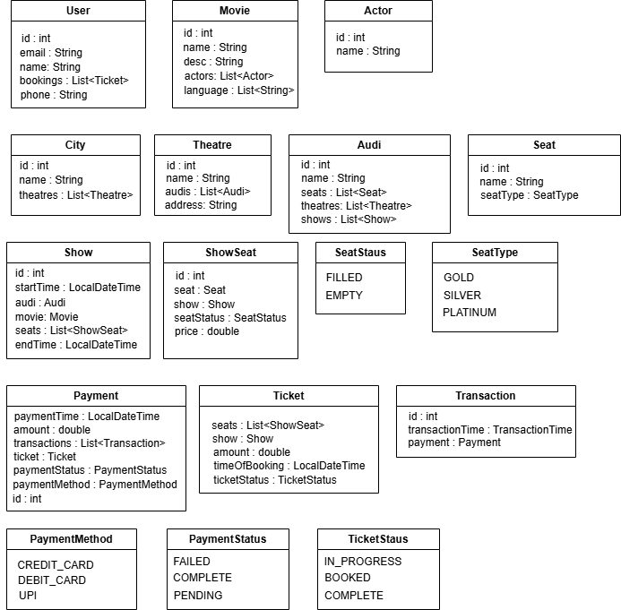
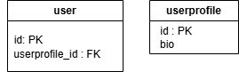
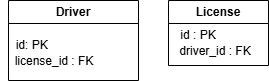
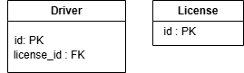
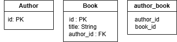
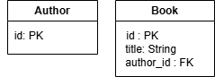

# BookMyShow

## Requirement Gathering

1. Let's limit this process to only booking movie tickets. 
2. User will come and select a city.
3. Each city will have multiple theatres.
4. Each Theatre will have multiple Audis.
5. Theatres can have multiple shows running at same time.
6. An Audi can only have 1 show at one time.
7. User can select city - theatre - movie they want to see.
8. User can select the audi they want to see movie in. 
9. Selection of audi will be dependent on -
   1. User can choose feature - 2d/3d
10. Now user can choose seats they have to choose.
11. Seats have different types - Gold,silver and platinum
12. Payment can be done in any mode - Credit card, UPI etc.
13. Once booking is done, generate a ticket having all the details.
14. An audi will have a 2D matrix which will be shown in the UI, it can have
    1. Seats
    2. Empty places
    3. Gates
15. UI gets the data of map, and user will only select places which are seats. So no need to add those checks.

## Class Diagram


## User Journey

User - City - Movie - Theatre - Audi - Seats - Payment - Ticket

## Spring boot 

Features:
1. IOC and Dependency Injection 
   1. Spring takes the responsibility of creating objects.
2. ORM
   1. It will map the Java classes to Database

### Annotations

1. @mappedSuperClass - 
   1. The attributes defined in class with this annotation will be present in all the sub-classes.
   2. We need to have classes extend this class.
   3. In this example "id" is present in all the classes, so we have a separate BaseModel class with this attribute.
2. @id - This field is a Primary key
3. @GeneratedValue(GenerationType_AUTO) - Value gets auto-generated
4. @Column(name="column_name") - Columns in the table.
5. @ElementCollection - Used on attributes which are a list of enums
6. @Enumerated(EnumType.String) - Tells that this attribute is ENUM.

### application properties file

1. spring.jpa.hibernate.ddl_auto : 
   1. create - At the application startup , all the tables are dropped and data is lost.
   2. update - After application startup, it only the runs the changes
   3. verify 
2. spring.jpa.properties.hibernate.show_sql : 
   1. true - shows the sql queries in the logs.
3. spring.jpa.properties.hibernate.dialect :
   1. org.hibernate.dialect.PostgreSQLDialect
4. database info :
   1. spring.datasource.url
   2. spring.database.username
   3. spring.database.password

### Relationships in models(Cardinality with direction)

We can have 2 types of dependencies:
1. Uni-Directional
2. Bi-Directional

eg.
1. A -> B eg. city -> theatres
2. B -> A eg. IIT-TOPPER -> Coaching
3. A - B eg. colors -> brand , brand -> colors


#### One to One

1. Uni-directional - @OneToOne


```
@Entity(name="user")
public class User{
   @Id
   private long id
   @OneToOne
   private UserProfile userprofile
} 

@Entity(name="userProfile")
public class UserProfile{
   @Id
   private long id;
   private String bio
}
```

We have a foreign key in the User Table. This is how the table will look like:



2. Bi-directional - @OneToOne , mappedBy

```
@Entity(name="driver")
public class Driver{
   @Id
   private long id
   @OneToOne
   private License license
} 

@Entity(name="license")
public class License{
   @Id
   private long id;
   @OneToOne(mappedBy = "license")
   private Driver driver
}
```

Here we wanted to access driver by license and licence by driver. So we need bi-directional.
Now if we do not use mappedBy in License class, this is how the tables will look like:



And if the mapped by is present, it will have FK only 



#### One to Many / Many to One

1. Uni-directional - @OneToMany,@JoinColumn

```
@Entity(name="school")
public class School{
   @Id
   private long id
   @OneToMany
   @JoinColumn(name = "school_id)
   private License license
} 

@Entity(name="classroom")
public class Classroom{
   @Id
   private long id;
   private String name
}
```

If we do not use @joinColumn, then it creates an extra table. Which is something we want in many to many, not here.
The @JoinColumn(name = "class_variable") , this way we tell JPA that we want FK in classroom table.

Without use of @JoinColumn:


Correct case : With use of @JoinColumn:


2. Bi-directional - @OneToMany,@ManyToOne,mappedBy

```
@Entity(name="author")
public class Author{
   @Id
   private long id
   @OneToMany(mappedBy = "author")
   private List<Book> books
} 

@Entity(name="book")
public class Book{
   @Id
   private long id;
   @ManyToOne
   private List<Author> authors
}
```

If we do not add mappedBy, then it has FK and also has a mapping table. We do not want mapping table, so we use mappedBy.

Without use of mappedBy:



With use of mappedBy:



#### Many to Many

1. Uni-directional

```
@Entity(name="course")
public class Course{
   @Id
   private long id
   @ManyToMany
   private List<Student> students
} 

@Entity(name="student")
public class Student{
   @Id
   private long id;
   String name
}
```


2. Bi-directional

```
@Entity(name="movie")
public class Movie{
   @Id
   private long id
   @ManyToMany(mappedBy="movies")
   private List<Actor> actors
} 

@Entity(name="actor")
public class Actor{
   @Id
   private long id;
   @ManyToMany
   private List<Movie> movies;
}
```

If we do not use mappedBy, then we will have 2 mapping tables.

Without use of mappedBy


Correct case : With use of mappedBy


## Transaction Isolation level

- A transaction is - A group of operations that must behave like one unit 
- Start → Do work → Commit OR Rollback 
- Before commit: Changes are temporary 
- After commit: Changes are permanent

Isolation level = How much one transaction is isolated from another. Defined by SQL standard.

Problems Isolation levels solve:

| Problem             | Meaning                    |
| ------------------- | -------------------------- |
| Dirty Read          | Reading uncommitted data   |
| Non-repeatable Read | Data changes between reads |
| Phantom Read        | New rows appear suddenly   |

1. READ UNCOMMITTED - 
   - Transactions can see everything, even uncommitted changes 
   - What it allows :
     - Dirty Reads 
     - Non-repeatable Reads 
     - Phantom Reads 
   - Used - Almost never
   - Pros - 
     - Fastest possible reads. No waiting, no blocking 
     

2. READ COMMITTED -
   - Transactions see only committed data
   - What it prevents :
      - Dirty Reads
   - What it allows : 
     - Non-repeatable Reads
     - Phantom Reads
   - Pros -
      - Good balance of correctness + speed 
      - Low locking overhead
     

3. REPEATABLE READ 
   - Once a transaction reads a row, it will always see the same value.
   - What it prevents :
      - Dirty Reads
      - Non-repeatable Reads
   - What it allows :
      - Phantom Reads
   - Pros -
      - Ensures consistency across multiple reads
      - Avoids mid-transaction surprises


4. SERIALIZABLE 
   - Transactions behave as if they run one after another
   - What it prevents :
      - Dirty Reads
      - Non-repeatable Reads
      - Phantom Reads
   - Pros -
      - Absolute correctness, no parallel writes.

**Summary**

| Level            | Dirty Read | Non-repeatable | Phantom | Use Case             |
| ---------------- | ---------- | -------------- | ------- | -------------------- |
| READ UNCOMMITTED | ✅          | ✅              | ✅       | Rare                 |
| READ COMMITTED   | ❌          | ✅              | ✅       | Most systems         |
| REPEATABLE READ  | ❌          | ❌              | ⚠️      | Finance, inventory   |
| SERIALIZABLE     | ❌          | ❌              | ❌       | Critical correctness |


## Database Locking

- Locking answers: Who is allowed to modify data right now? 
- Locking is about control, not visibility.
- Locks can be placed at Table,Row levels.

### Pessimistic Locking (Locking based control)

- You lock the resource before reading or writing. 
- Example :
  - User X locks Seat A1 
  - User Y waits 
- Where used? 
  - BookMyShow during flash sales 
  - IRCTC tatkal bookings
- Pros:
  - Very low chance of errors
- Cons:
  - Slow

### Optimistic Locking (Versioning based control)

- No lock while reading. Check if data changed before saving
- Example(Version column) :
   - Seat A1: status=FREE, version=5 
   - User X: 
     - UPDATE seats  SET status='BOOKED', version=6 WHERE seat_id='A1' AND version=5; 
   - Rows updated = 1 → success 
   - Rows updated = 0 → conflict → retry
- Pros:
   - No blocking
   - High throughput
   - Great for read heavy systems.
- Cons:
   - Retries under contention
   - Bad for flash sales

## How do we stop double booking?

1. We will use the "Serializable" transaction, whenever starting the book ticket flow. This will include finding the ticket, and comitting a ticket.
2. And we will use "Pesimistic locking" while updating the row. So no 2 users can get the same seat at the same time.

Another way:
1. We use "READ_COMMITTED" for a transaction book_ticket start.
2. and we put a lock when we findById() in seatRepository.
3. This will work because Serializable is overkill, considering concurrency is already handled by locking.

## Output:

POST - http://localhost:8080/ticket

RequestBody - 
```
{
    "seatIds":[1,2],
    "userId" : 1
}
```

Response -

```
{
    "auditoriumName": "Audi1",
    "movieName": "DDLJ",
    "seatNumbers": [
        "1A",
        "2A"
    ],
    "timeOfShow": "2025-12-28T09:00:00",
    "totalAmount": 200.0
}
```